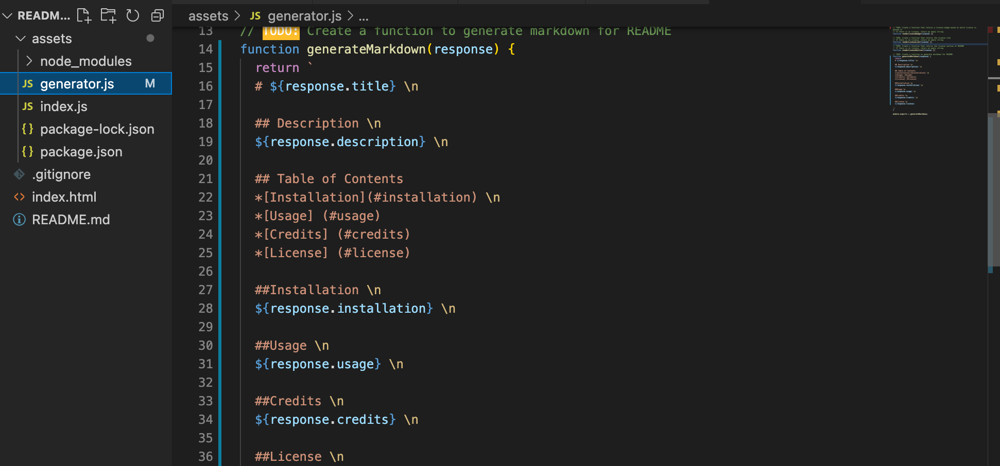
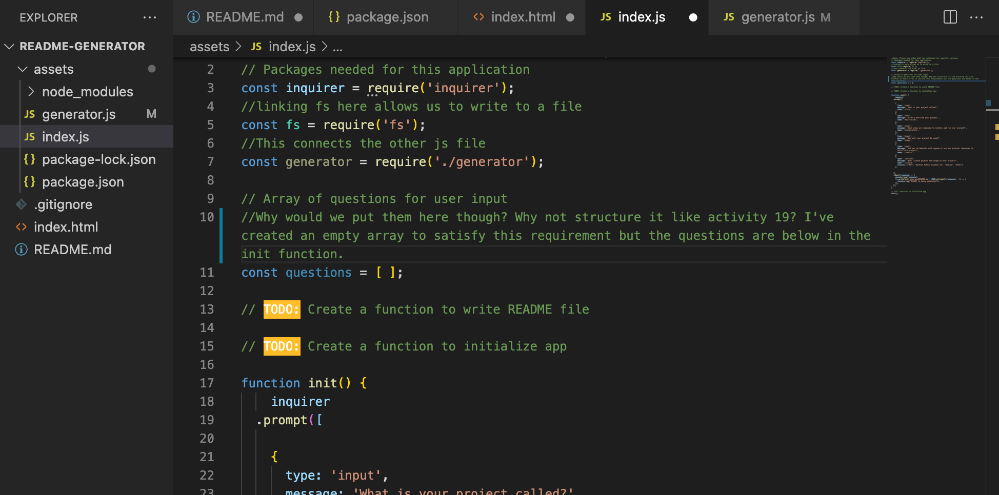

# readme-generator

## Description

This project generates professional-grade README files using Node. It was built to make it easier for developers to generate quality READMEs using only the command line, without having to open .md documents. It has also been a great way for me to master the basics of Node. 

## Table of Contents

- [Installation](#installation)
- [Usage](#usage)
- [Credits](#credits)
- [License](#license)

## Installation

Set up Node.js.Run pnm install and make sure you have Inquirer. Enter all values in the command line when prompted. 

## Usage

Use this app to generate a README file. Answer each prompt in your command line to generate. 

Screenshots:
    ```md
    
    ```
        ```md
    
    ```

## Credits

Sources used include:
-Node documentation: https://nodejs.dev/learn/writing-files-with-nodejs
-Class activities: 19, 9, 10 and mini project from Node unit
-List of license badges here: https://gist.github.com/lukas-h/2a5d00690736b4c3a7ba 
-Study group (Lina Choi, Seamona Stewart, Noah Brunner, Steve Snavely, James Edwards)
-Individual study group with Chris Rowe

## License

MIT